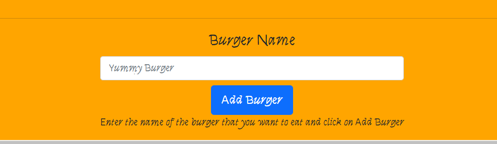
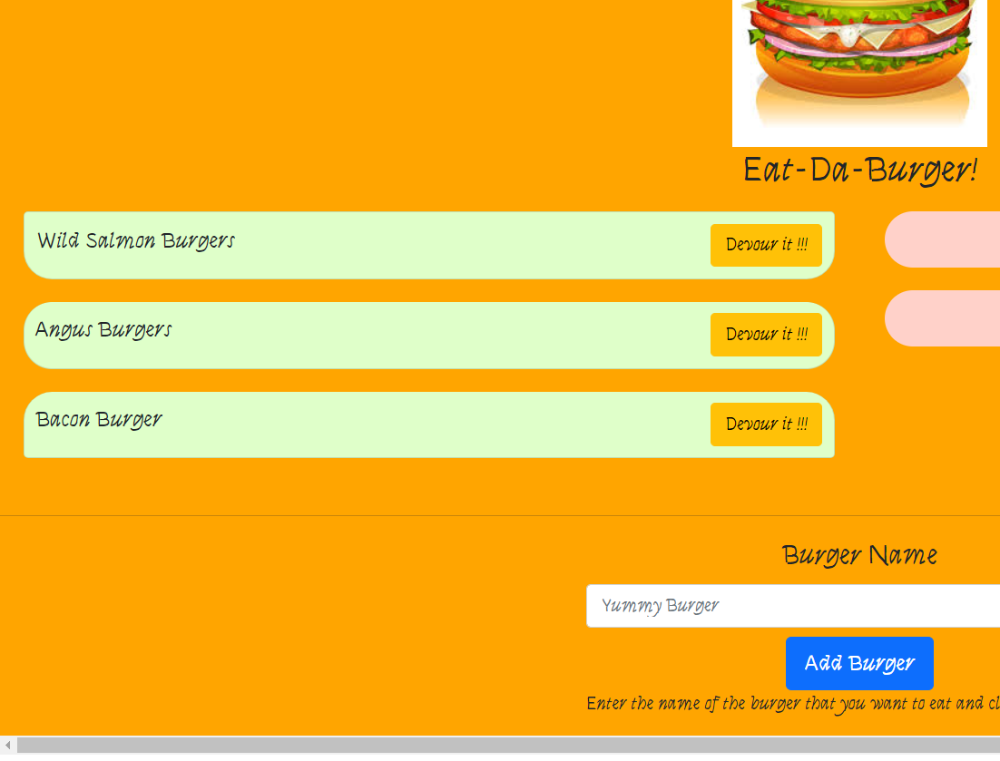
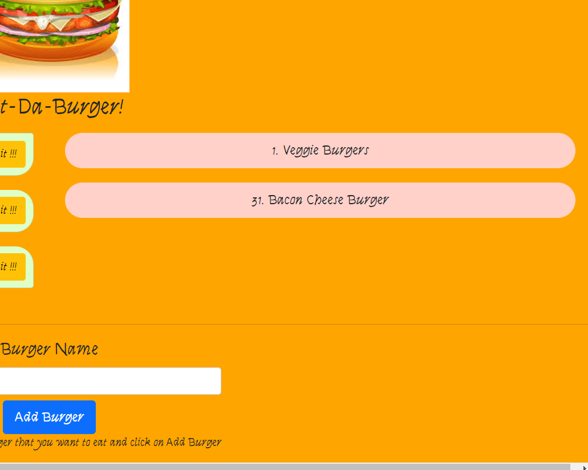

# Node Express Handlebars Burger Application

[](https://opensource.org/licenses/MIT)

## Description

The scope of this project was to create a burger logger with MySQL, Node, Express, Handlebars and a homemade ORM. The application follows the MVC design pattern and uses Node and MySQL to query and route data in the app, and Handlebars to generate the HTML.

## Table of Contents

* [Technologies](#technologies)
* [Installation](#installation)
* [Usage](#usage)
* [Deployment](#deployment)
* [Credits](#credits)
* [License](#license)
* [Questions](#questions)

## Technologies

- JavaScript
- NodeJs
- Express
- Handlebars
- MySQl

## Installation

Install express, handlebars and mysql within package.json file using `npm install` command.

The dependencies are below:

* Use the [MySQL](https://www.npmjs.com/package/mysql) NPM package to connect to your MySQL database and perform queries.

* Use [express](https://www.npmjs.com/package/express) NPM package to that provides a robust set of features for web and mobile applications.

* Use [Handlebars](https://www.npmjs.com/package/handlebars) a templaing language that provides the power necessary to let you build semantic templates effectively 


## Usage

* Application allows users to add burgers that they would like to eat.



* Once the burger is entered and the add burger button is clicked,the burge is displayed on the left side f the screen with a button to devour it.



* When user devours the burger, it gets added to the list on the right side of the screen



## Deployment

Application is deployed to heroku

```bash
  $ git commit -m "{UPDATED MESSAGE}"
  $ git push origin master
  $ git push heroku master
```

This will deploy to [heroku](https://stormy-falls-15404.herokuapp.com/) 


## Credits

**[Anjali Pant](https://github.com/Anjali9293)**

## License 

```
Copyright 2020 <Anjali Pant>

Permission is hereby granted, free of charge, to any person obtaining a copy of this software and associated documentation files (the "Software"), to deal in the Software without restriction, including without limitation the rights to use, copy, modify, merge, publish, distribute, sublicense, and/or sell copies of the Software, and to permit persons to whom the Software is furnished to do so, subject to the following conditions:

The above copyright notice and this permission notice shall be included in all copies or substantial portions of the Software.

THE SOFTWARE IS PROVIDED "AS IS", WITHOUT WARRANTY OF ANY KIND, EXPRESS OR IMPLIED, INCLUDING BUT NOT LIMITED TO THE WARRANTIES OF MERCHANTABILITY, FITNESS FOR A PARTICULAR PURPOSE AND NONINFRINGEMENT. IN NO EVENT SHALL THE AUTHORS OR COPYRIGHT HOLDERS BE LIABLE FOR ANY CLAIM, DAMAGES OR OTHER LIABILITY, WHETHER IN AN ACTION OF CONTRACT, TORT OR OTHERWISE, ARISING FROM, OUT OF OR IN CONNECTION WITH THE SOFTWARE OR THE USE OR OTHER DEALINGS IN THE SOFTWARE.
```

## Questions

For more questions about this project, click the link below to view my Github repo:

- [GitHub Profile](https://github.com/Anjali9293)

You can also reach me directly at: pantanjali7@gmail.com
